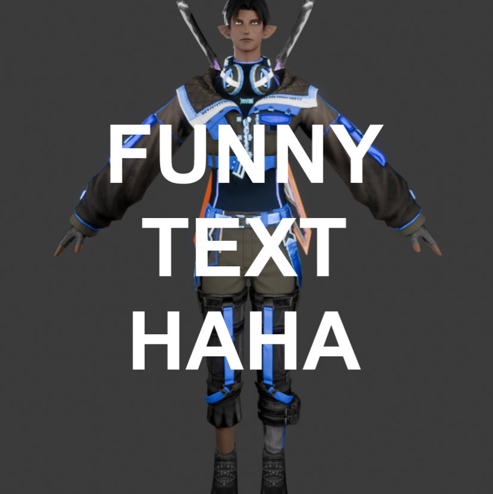
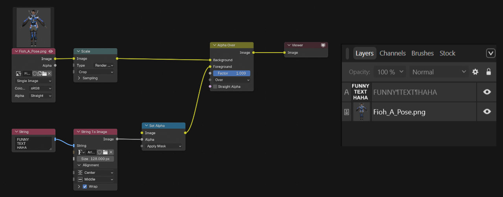

# What are Nodes?
Nodes are the more advanced version of Layers.
{: .fs-6 .fw-300 }

If you're here you're probably used to thinking about things in layers. If you want to write some text on an image, you just create a text-layer and put that on top of your image.    
With nodes we would instead load the image, create the text, then merge the two together with a separate node. If you want to move or scale the text, that's also a node.  

Below you'll see a really awesome image, the node setup used to create it, and the equivalent in layers.

  
  

## "Why on earth would we do this?"
...is what you may be asking yourself right about now. Nodes are, as you can probably tell, more work to set up, but they also come with a lot of benefits:
* **They're Procedural**  
Say you have an image like A-posing Fioh here (except pretend he's cut out from the background) and you wanted to add a distorted blue drop-shadow behind him. Or five of them, in different colors, offset in a different direction. With layers, you would copy Fioh five times, make him different colors, move them around a bit, distort them. Then you realize you actually don't want it to be Fioh you want it to be your own character, so you render that instead. Now you need to go and replace all those images or re-do the work on each layer.  
With nodes, all those images would just reference a single Image node. Pick a different image, everything automatically updates. Almost everything you make is procedural by nature. 

* **Top-down View**  
With complex projects you often end up grouping / nesting / pre-composing layers into a little bundle of multiple layers. And then you group those groups, and then group those groups of groups, and everything just becomes a big mess.  
With nodes you *can* group things, but you don't need to, and often it's just for re-using custom effects. You always have a top-down view of your entire project, like a big flow-chart.  
With layers, you can put a bunch of effects on a layer and you won't always be able to tell by looking at the layer which exact effects are enabled and what their settings are.  
With nodes, each effect is a node, so you can always see exactly what is where and in what order things are happening. 

* **Easy Debugging**  
In a node-tree or node-graph, you can always just look at the output of any node and see what your nodes are generating at that point. You're making a material and it looks too shiny? Just take a look at what's going into the Roughness and Metallic inputs of your main shader node. You might find that your Roughness is completely black, so somewhere along that node-line something is going wrong. You're probably multiplying it with 0, or something.  
Once you get used to jumping between points in your node-tree this becomes one of the biggest strengths of nodes. You'll know exactly what is happening where, at all times.

They might still seem intimidating, but trust me when I say they really aren't too bad. Try making some Materials or Compositing Setups in Blender and you'll get the hang of it quickly.

## Examples

### Order of Operations
A node just does *something*. Whether that be saturation adjustments, a curves adjustment, or multiply a color with your image.
<video src="assets/nodes_oop.webm" loop autoplay style="max-width:100%;"></video>
You can think of the image like it's going through the yellow line. At each node, something happens to it, then it continues onward until it reaches the output node.